# Geographica
Welcome to Geographcia. Geographica is a quiz webapp designed to quiz and teach users about geography. The quiz covers 4 geographic regions (the Americas, Europe, Africa and Australasia) and asks 3 subject questions per region (one about borders, one about waters and one about mountains). The quiz also features a hint button which allows users to explore the world on a Google-maps-like interface custom built for the game. Throughout the game, the user learns fun facts about various regions around the world and is provided with feedback at the end of the game based on their final score.

You can visit the [live site here](https://adamsburge.github.io/geographica/).

 
 

## Mobile Responsiveness

The site is also mobile responsive as can be seen below:

### Home Page
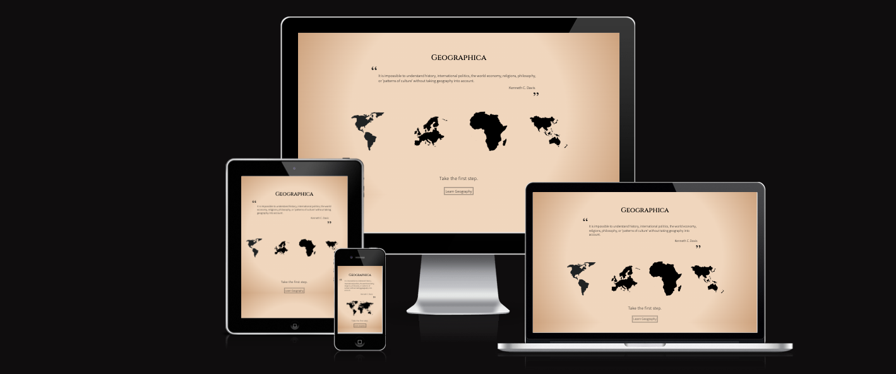

### Game Start
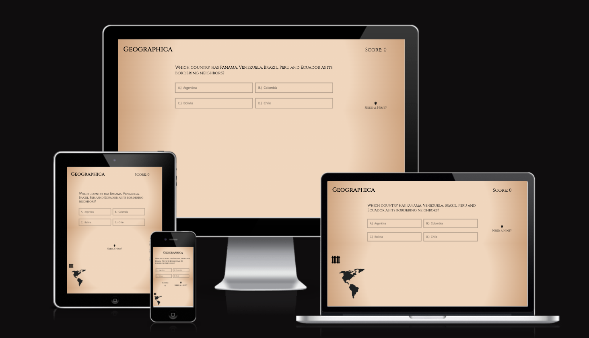

### Hint Page
NEED TO ADD THIS PHOTO
### Solution Loaded
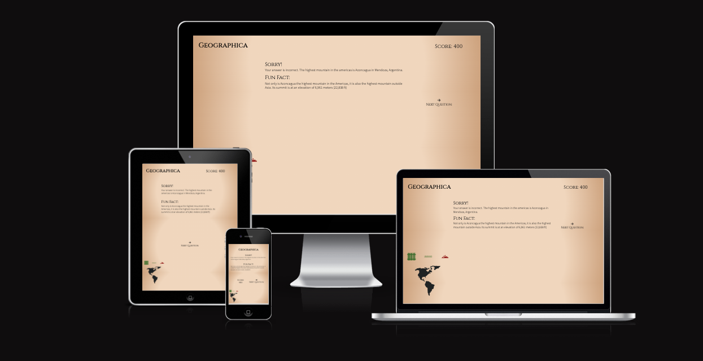
### Final Score Page
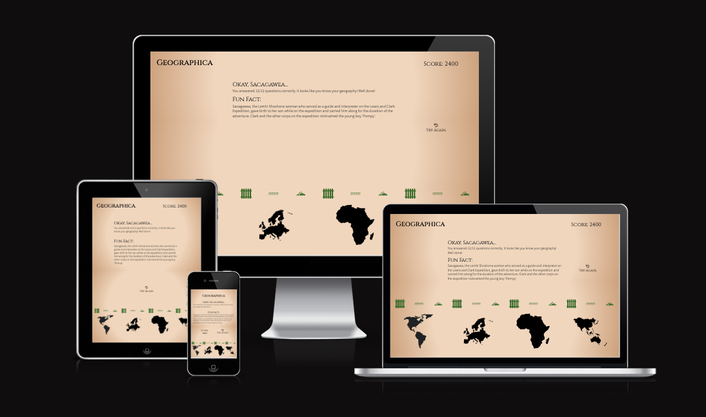
# Features

## Basic Site Overview

The webapp is split into two html pages. The first page, the home page, serves solely as a landing page and to provide the user with the inspirational quote encouraging them to learn about Geography by playing the game. The second page, the game page, is where the interactive game begins. The user is asked a series of questions about various geographic regions and the webapp provides the user with feedback based on correct or incorrect answers. It also allows the user to open a hint modal box which provides the user with a custom Google-maps-like interface to explore the geography of the world and find the answers to the questions.

## Home Page
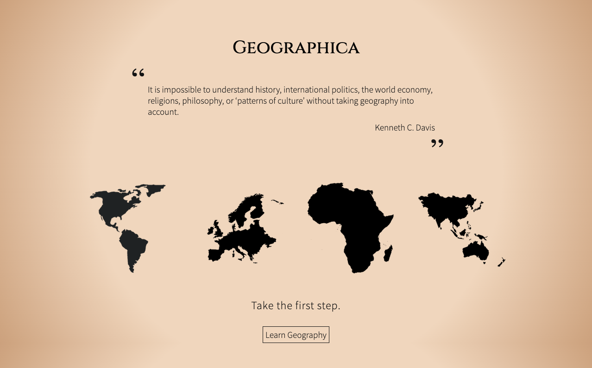

The home page presents the user with the title of the website, a quote from Kenneth C. Davis about the importance of Geography, 4 images of the various continental regions and a call to action which leads to a button that starts the game.
 

### Hover Effect
  
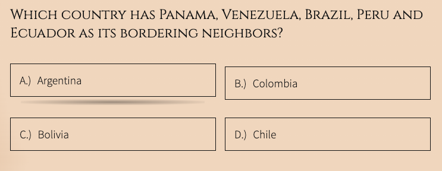

All the buttons throughout the site use a hover effect which places a shadow underneath the button. 

## Game Page
There are many different features on display on the game page. As the user progresses through the game, different content and buttons appear and disappear, a progress bar loads, and a total score is kept.

### Game Start
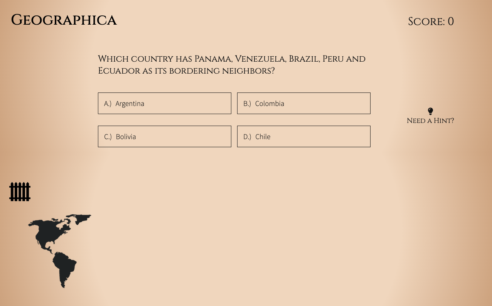
At the start of the game, the page loads the first question. The user is provided with 4 multiple-choice answer options. This question view provides the user with a hint button which opens a modal box containing a hint, a score label which adds 200 points for every correct answer, and a progress bar at the bottom of the page.

### Hint Button
NEED TO ADD THIS 

### Solution Display
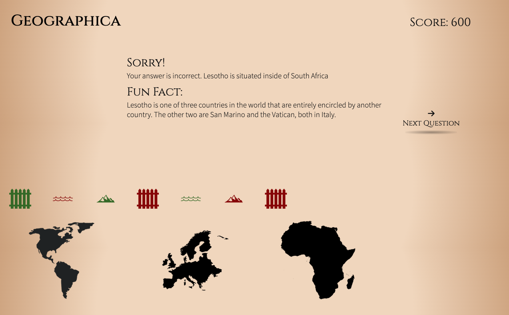

When the user clicks on an answer, the solution section is loaded and either congratulates the user for their correct answer or offers condolences for getting the answer incorrect. Additionally, underneath the inital response, a fun fact is provided which relates to the question that was just asked.

### Progress Bar

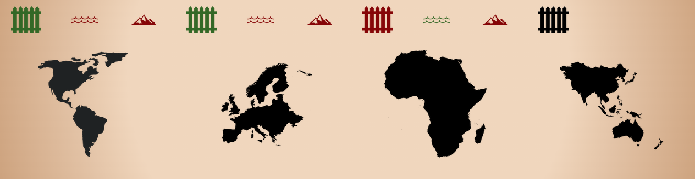

The progress bar is split into two levels. The top level tells the user two things: 1.) the topic of the question they are on (borders, waters, or mountains) and 2.) which questions they have gotten correct or incorrect. The bottom level of the progress bar tells the user which continent the current question pertains to. Both levels are slowly displayed as the user progressed through the game.

### Final Score Display
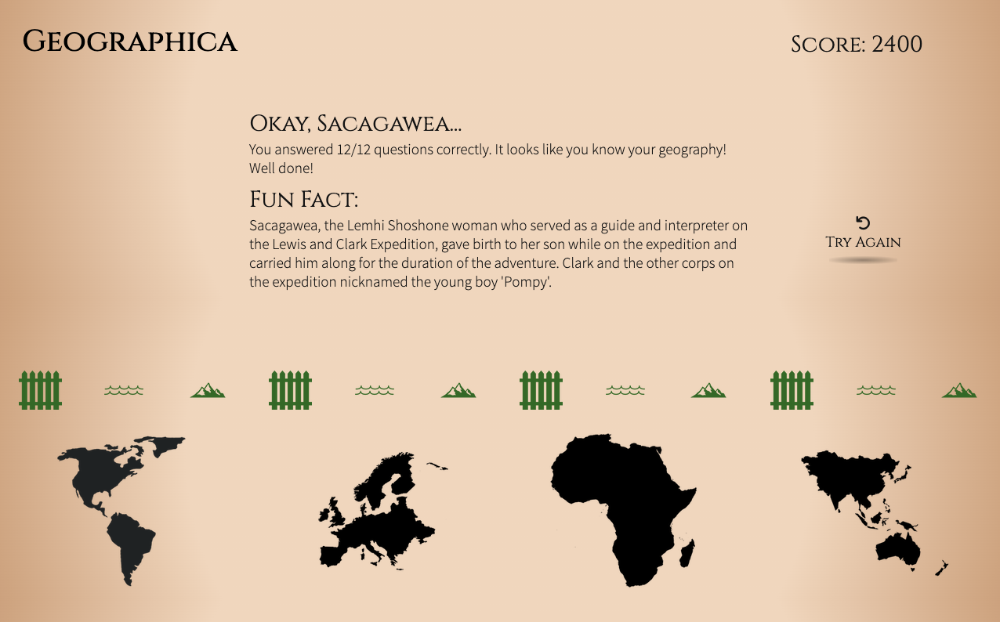
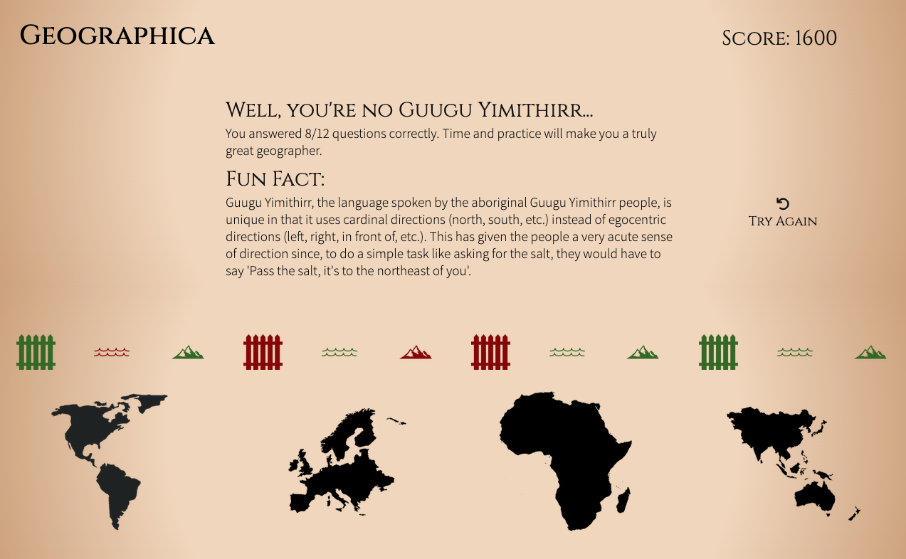
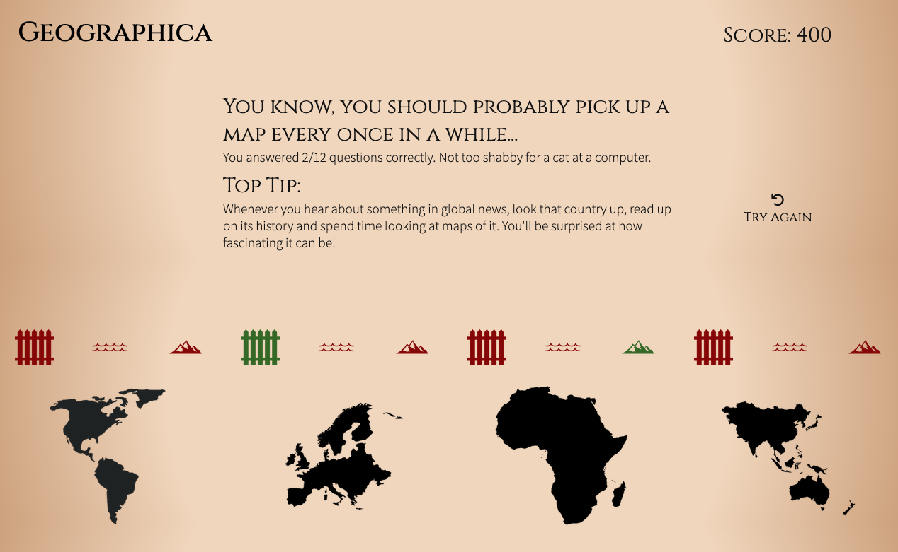

At the end of the game, the user is presented with their final score along with an answer based their score. User scores above 1600 points receive the high-tier response, scores between 800 and 1600 receive the mid-tier response, and scores below 800 receive the lower-tier response.

### Changing of Buttons
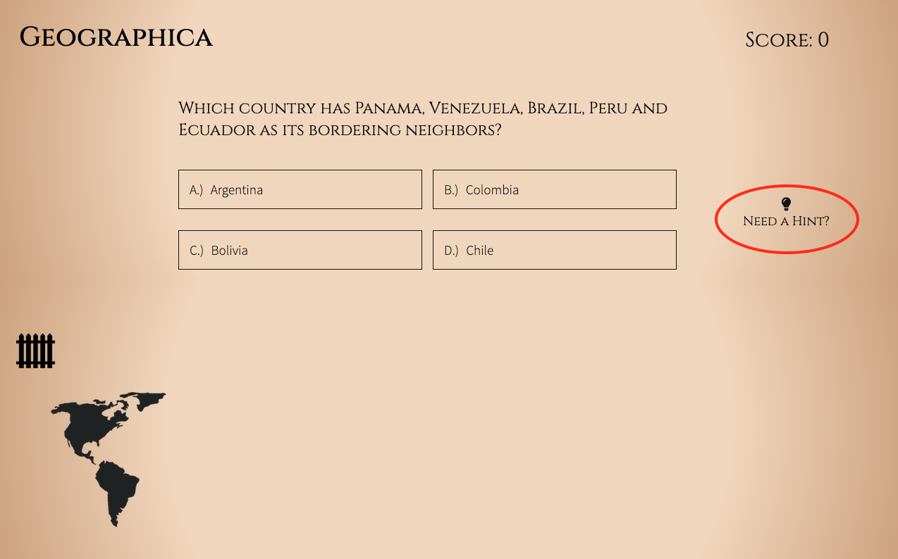
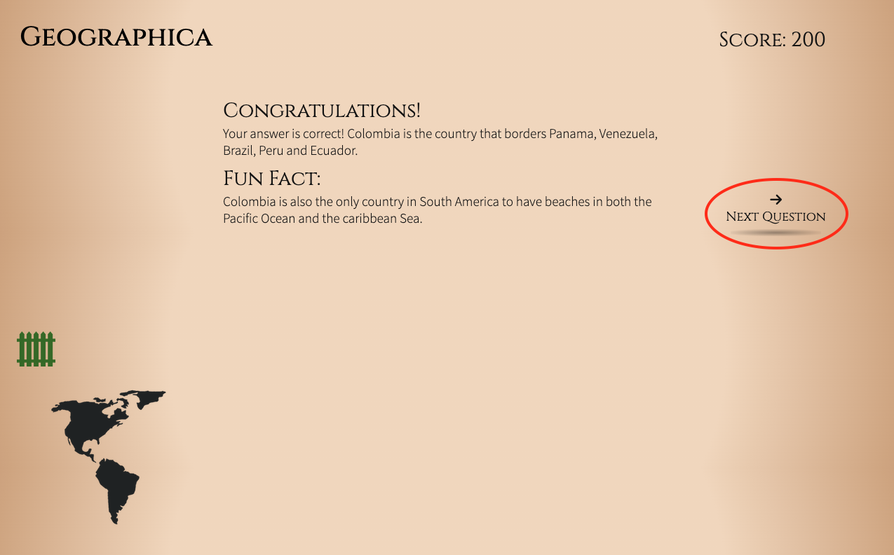
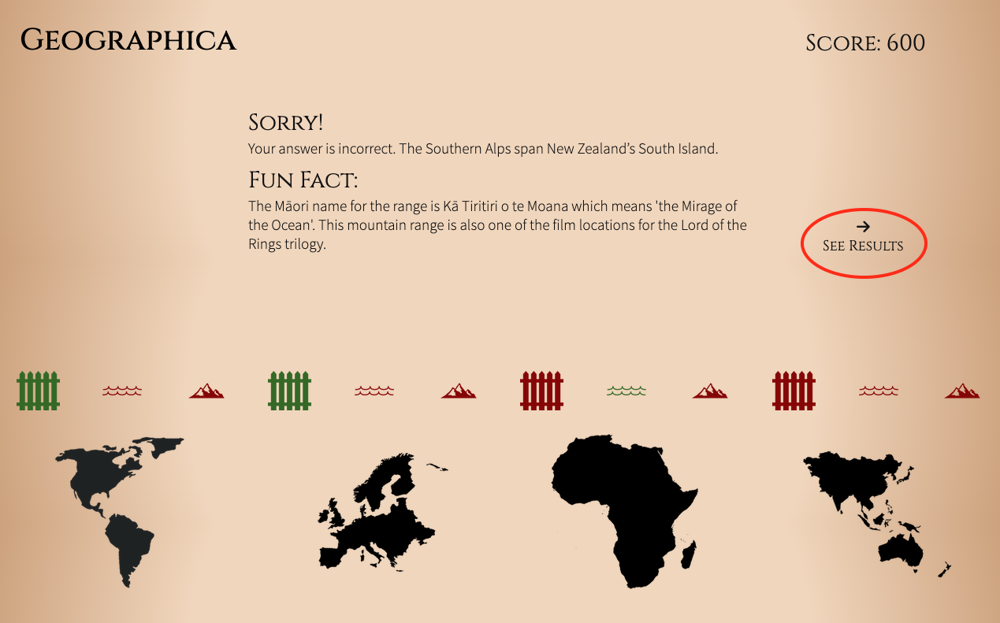
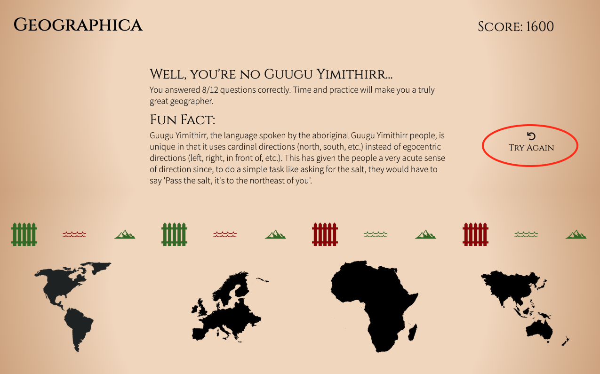

All the auxilary buttons (Hint Button, Next Question, See Results, and Try Again Button) appear in the same place.

# Testing

- The webapp has been manually tested for desktop on Google Chrome, Microsoft Edge, Firefox, Safari, and Vivaldi. 
- Additionally,the webapp has been manually tested for mobile responsiveness on an iPhone 7 and an iPhone 8 as well as using both devtools and [Screenfly](https://bluetree.ai/screenfly/) to test the webapp on various Apple and Android mobile phones and tablet devices from the iPhone 4 onward. 
- The webapp looks good on all the major desktop web browsers and all the most popular tablet and mobile devices. I can confirm that the website looks good on all screensizes.

## Validator Testing

## Bugs

### Solved

### Unsolved

# Deployment

- Just like [my previous project](https://github.com/adamsburge/Ancient-Languages-Society), I have deployed the website through GitHub Pages. To do this, I:
    - navigated to the GitHub repository and selected settings
    - on the lefthand side, I selected the 'Pages' option from the menu navigation
    - Under 'Source', I selected the main branch
    - Then the live website link was provided

    The website can be accessed [here](https://adamsburge.github.io/geographica/).

# Credits

## Content
- The content of the website was researched and written by myself. Find the sources for each question below:

### Question Sources:
- Americas
    - Border Question
    - Water Question
    - Mountain Question 
- Europe
    - Border Question
    - Water Question
    - Mountain Question 
- Africa
    - Border Question
    - Water Question
    - Mountain Question 
- Australasia
    - Border Question
    - Water Question
    - Mountain Question 

## Design and Aesthetic

### General Inspiration

### Media Sources

## Code Snippets

## Tools Used

## Feedback